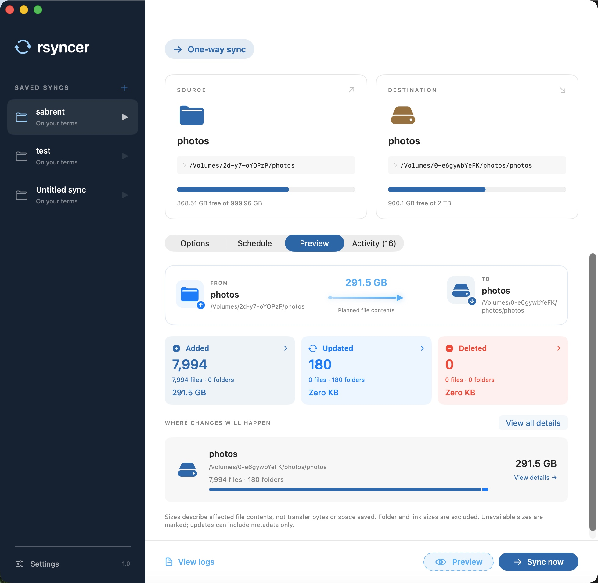

# rsyncer

A native macOS app for syncing files and folders between local drives and mounted volumes. Requires macOS 14 or later.



## Features

- **One-way sync** — Copies a file or a folder's contents to a destination. Optionally protects newer destination files and removes files that no longer exist at the source.
- **Two-way sync** — Merges two folders in both directions, with the newest version of each file winning.
- **Safe previews** — Shows planned additions, updates, and deletions before changing anything, with searchable item details and affected file sizes.
- **Transfer controls** — Start, pause, resume, or stop a sync and follow its per-file progress in the app, menu bar, or Dock.
- **Scheduling** — Run saved syncs hourly, daily, weekly, or when a drive connects. Missed timed runs resume when the app is available.
- **Saved syncs** — Automatically saves paths, options, schedules, names, and sidebar order for repeat use.
- **Transfer options** — Supports timestamps, permissions, links, Mac metadata, checksums, exclusions, bandwidth limits, partial files, and other common `rsync` controls.
- **Volume status** — Displays free space, capacity, availability, read-only state, and low-space warnings for connected drives.
- **History and logs** — Keeps the latest 250 runs in the app and writes a complete log for every run.
- **Menu bar and login launch** — Continues running after the window closes and can launch automatically when you sign in.
- **Themes** — Includes six accent and sidebar colour themes.

## Using rsyncer

To install from a DMG, open it, drag **Rsyncer** onto **Applications**, then eject the disk image and launch Rsyncer from Applications.

1. Click **+** beside **Saved syncs** and choose a one-way or two-way sync.
2. Drop in the source and destination, or browse to them, then choose the transfer options and schedule.
3. Select **Preview** to review the plan, then **Sync now** to run it.

If you enable **Launch at login**, macOS may require approval under **System Settings → General → Login Items**.

## Sync behaviour

One-way sync never removes source files. Destination-only files are retained unless deletion is explicitly enabled. Deletion applies to scheduled runs and bypasses the Trash.

Two-way sync runs source to destination first, then returns changes in the other direction. Newer modification dates win; deletion is disabled, so a file removed from one side is restored from the other. Checksums can detect equal-size files whose dates also match.

The scheduler runs one job at a time. The app prevents idle sleep during transfers, but cannot wake a sleeping or powered-off Mac. Drive-connection schedules only detect mount events while the app is running.

## Access and data

Allow access to files and folders when macOS prompts you. Protected locations may require **Full Disk Access**.

Volumes are matched by mount path by default, so Cryptomator vaults can reconnect even when their UUID changes. The volume must still be mounted at the saved location; another volume mounted there will also be accepted. Enable **Match volumes by UUID** in Sync options to additionally require the saved UUID. Existing syncs under `/Volumes` use mount-path matching automatically; older syncs at custom mount locations retain UUID checks until you choose their folders again.

The app rejects missing, overlapping, or unsafe locations before a run. Cancellation may leave partial files at the destination.

Settings and logs are stored in:

```text
~/Library/Application Support/rsyncer/state.json
~/Library/Application Support/rsyncer/Logs/
```

## Building a DMG

With Xcode installed and selected as the active developer directory, run:

```sh
./scripts/build-dmg.sh
```

This builds a Release app for Apple Silicon and Intel Macs and creates `build/Rsyncer-1.0.dmg` (using the app's version number). The disk image contains **Rsyncer.app** and an **Applications** shortcut with large icons, a Retina background, and drag-and-drop instructions. Running the command again replaces the DMG for that version.

Packaging uses Finder to save the installer window layout, so run it in a logged-in macOS desktop session. If macOS asks, allow your terminal to control Finder. The background and layout are defined in `scripts/generate-dmg-background.swift` and `scripts/layout-dmg.applescript`.

Packaging also uses Python 3 (available with Xcode's command-line tools) to finalize the stored icon coordinates and verifies them from the finished, read-only DMG. If Finder shows `.background` or `.fseventsd`, press **Command–Shift–Period** to turn off showing hidden files. Eject older Rsyncer images before opening a rebuilt DMG.

The default build is ad hoc signed for local testing. For public downloads that pass macOS Gatekeeper, use a **Developer ID Application** certificate and Apple notarization, which require Apple Developer Program membership. In Xcode, choose **Product → Archive**, then distribute the archive using **Developer ID**, upload it for notarization, and export the notarized app. Package that export with:

```sh
./scripts/build-dmg.sh /path/to/export/Rsyncer.app
```

The script preserves the exported app's signature and notarization ticket. To also sign and notarize the DMG, use your Developer ID identity and a previously configured `notarytool` keychain profile:

```sh
codesign --timestamp --sign 'Developer ID Application: Your Name (TEAMID)' build/Rsyncer-1.0.dmg
xcrun notarytool submit build/Rsyncer-1.0.dmg --keychain-profile 'rsyncer-notary' --wait
# Continue only after the submission status is Accepted.
xcrun stapler staple build/Rsyncer-1.0.dmg
xcrun stapler validate build/Rsyncer-1.0.dmg
```

See Apple's [notarization instructions](https://developer.apple.com/documentation/security/notarizing-macos-software-before-distribution) for certificate and credential setup. Test the downloaded DMG on another Mac before publishing a release.
