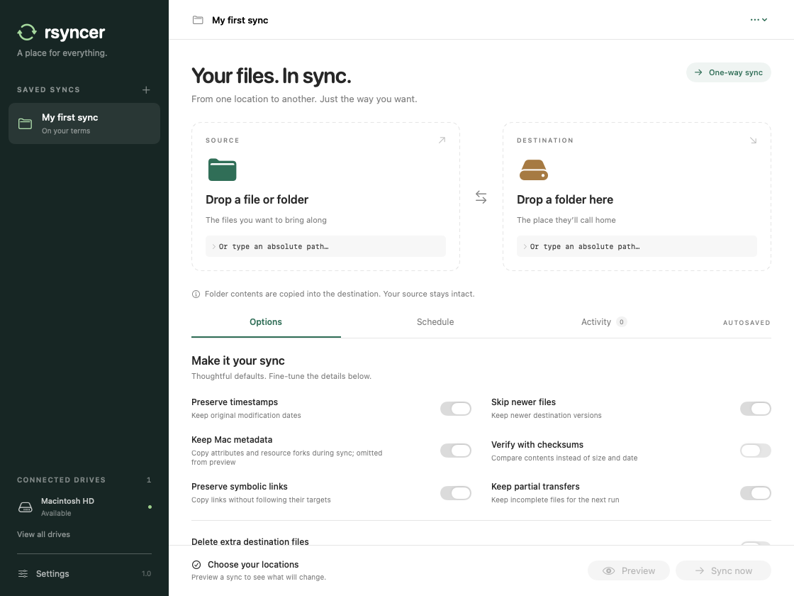

# rsyncer

A native SwiftUI macOS app for syncing files and folders between local drives and mounted volumes. Requires macOS 14 or later. No third-party dependencies.



Open `rsyncer.xcodeproj` in Xcode, select the **rsyncer** scheme and **My Mac**, then run. For login-item registration, use a signed app installed in a stable location such as `/Applications`.

## Using the app

1. Drop a file or folder into **Source**, and a folder or mounted volume into **Destination**. You can also click to browse or type an absolute path (`/…` or `~/…`).
2. Name the pair. Paths, options and schedules save automatically.
3. Use **Preview** to inspect planned file changes without writing to the destination.
4. Choose **Sync now**. Activity shows live output and previous runs; each run has a complete log file.

Click and hold a saved sync’s name or folder icon, then drag it to a new position in the sidebar. Cards shift as you drag, and the order is saved automatically. You can also right-click to rename, delete, launch, pause/resume, or move it up or down. Running syncs show spinning arrows; paused syncs show a pause icon. Rename and delete become available after the active run ends. Pause/resume is also available in the sync screen and menu bar; stopping a paused sync cancels it.

Syncs are one-way. A directory's contents are copied into the destination, without creating an extra enclosing directory. Source files are never removed. Existing destination files can be updated; the default **Skip newer files** option protects newer destination versions. Extra destination files are retained unless you explicitly enable deletion. This is not a bidirectional conflict-resolution tool or a versioned backup system.

The options include timestamps, permissions, symlinks, hard links, Mac metadata, checksums, skip-newer, ignore-existing, partial files, compression, whole-file transfers, filesystem boundaries, exclusions and bandwidth limits. Enabling deletion requires confirmation and also applies to scheduled runs. Excluded destination files are protected. Deletion bypasses the Trash.

## Scheduling and menu bar

Choose hourly, daily, weekly, or drive-connection schedules for each saved pair. Timed schedules use local time. The scheduler checks every 30 seconds, runs one job at a time, and retries unavailable locations once per minute. A missed timed run executes once when the app is available again, then advances to the next scheduled time. Drive-connection schedules respond to mount events observed while the app is running.

Closing the window leaves the menu bar app running. Quitting pauses scheduling; sleeping postpones runs until wake. **Launch at login** uses Apple's [SMAppService](https://developer.apple.com/documentation/servicemanagement/smappservice). macOS may require approval in System Settings → General → Login Items. The app prevents idle sleep during an active transfer, but does not wake a sleeping or powered-off Mac.

## Volumes, progress and logs

Click a selected source or destination icon to open that folder in Finder (file sources are revealed in their containing folder). Click the location name to choose another location.

Each selected source and destination shows a storage bar and free/total capacity. Unavailable locations are identified without showing misleading capacity.

Connected drives update after mount, unmount and rename events, and every minute. Indicators report capacity, low space (under 10% free), and read-only status. They do not measure SMART or hardware health; use Disk Utility for diagnostics.

Progress is **per file**, matching the bundled rsync's `--progress` output. Scanning and previews show indeterminate progress. No total-transfer percentage or ETA is fabricated.

The app runs `/usr/bin/rsync` directly using `Process` arguments, without a shell. Apple's openrsync has a failure when combining extended attributes and dry-run on some macOS versions. Previews therefore omit extended attributes/resource forks; actual syncs preserve them when enabled. The UI and preview log disclose this limitation.

Settings and logs live in:

```
~/Library/Application Support/rsyncer/state.json
~/Library/Application Support/rsyncer/Logs/
```

The latest 250 runs appear in history. Full logs stay on disk until manually removed and include paths and filenames. Live output is bounded in memory. Settings are written atomically; unreadable settings are preserved rather than overwritten.

## Filesystem access

This is a directly distributed, non-sandboxed macOS utility so the system rsync process can access user-entered paths and mounted volumes. macOS privacy protections still apply. Allow requested Files and Folders permissions; protected locations may require Full Disk Access. App Store distribution would require a different filesystem-access architecture. Signing and notarization are not included in this development build.

Locations must already exist. Validation rejects overlapping locations (including symlink aliases), the filesystem root, missing drives and unwritable destinations. Saved volume UUIDs help detect a different drive mounted at the same path. Filesystem permissions and disk failures during a run are reported through rsync's exit status and log. Cancellation can leave partial destination files.

## Validation

```sh
./scripts/test.sh
zsh scripts/test-ui.sh
xcodebuild -project rsyncer.xcodeproj -scheme rsyncer \
  -configuration Debug -derivedDataPath /tmp/rsyncer-build \
  CODE_SIGNING_ALLOWED=NO build
```

The integration harness runs the production command builder and process runner against isolated temporary folders. It covers dry runs, actual copying, Unicode and shell-like path names, exclusions, opt-in deletion, newer files, symlinks, checksums, metadata flags, single-file sources, path validation, volume identity and capacity lookup, pause/resume, cancellation while paused, saved-sync ordering and renaming, scheduling and persistence. It never syncs personal files or registers a login item.

The UI harness sends mouse events to an isolated app window and checks selection, live dragging in both directions, and saved order after release. It requires a macOS graphical session.

Physical unplug/replug, login after reboot, and macOS privacy prompts should be checked on the target Mac before relying on unattended runs.

Regenerate the app icon assets from `artwork/icon.png` with `swift scripts/generate-icon.swift`.
